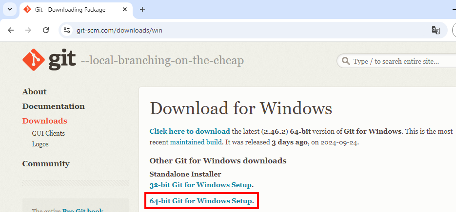
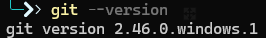
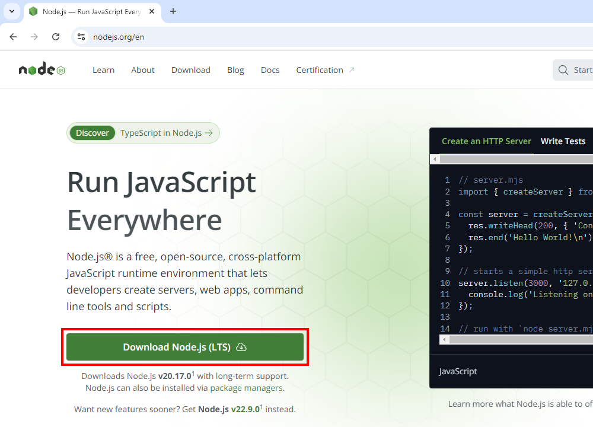
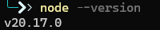
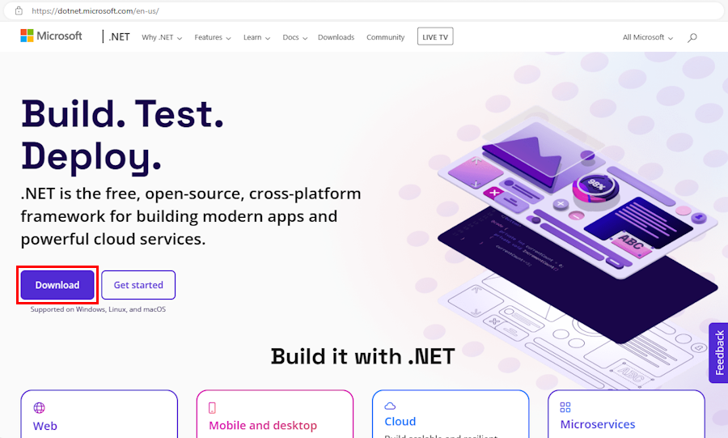
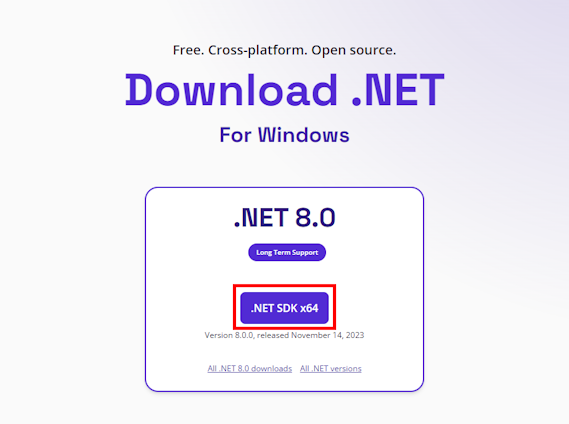
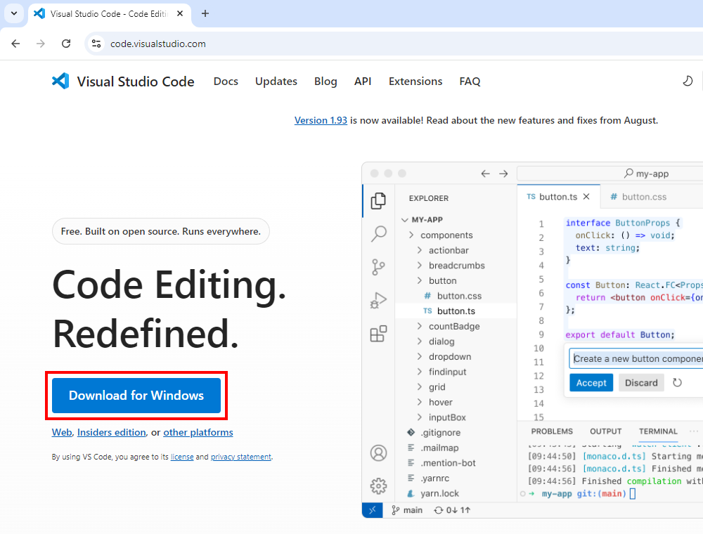
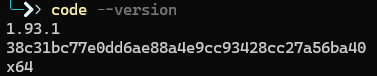
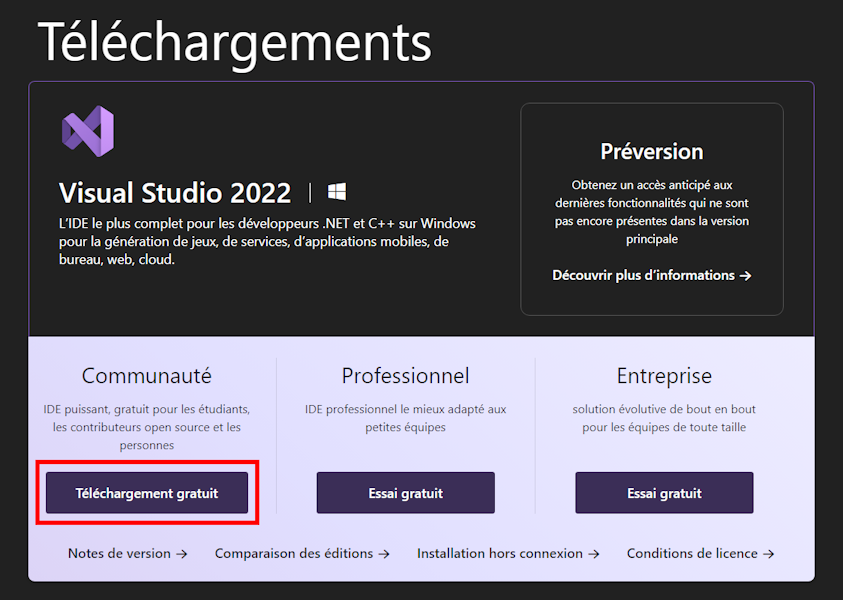
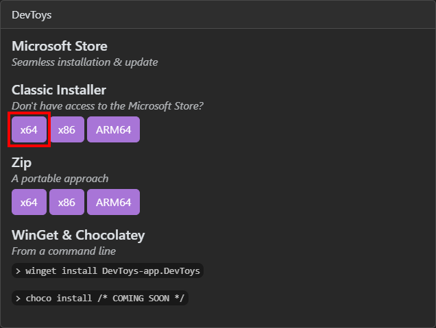

# Installation des logiciels de développement

## Objectifs

L'objectif de cette partie est d'installer les outils suivants sur votre machine :

- Git
- Node.js
- Dotnet 8.0
- Visual Studio Code
- Visual Studio 2022
- DevToys

Nous supposons ici que votre machine personnelle est/a :

- Un PC tournant sous Windows 10/11
- Un minimum de 16Go de mémoire vive
- Un minimum de 40Go d'espace disque libre
- Les outils ne sont pas pré-installés

## Winget - Installation rapide

> [!IMPORTANT]
> **Si vous désirez installer les logiciels à l'aide des installateurs conventionnels, ignorez ce chapitre.**

Windows est désormais distribué avec le gestionnaire de packages [Winget](https://learn.microsoft.com/en-us/windows/package-manager/winget/#use-winget). Cet outil permet de [rechercher, installer et mettre à jour](https://learn.microsoft.com/en-us/windows/package-manager/winget/#commands) les logiciels sur votre ordinateur.

Ouvrez un [invite de commande](LIGNE_COMMANDE.md) **en mode administrateur** et collez cette ligne :
```bash
winget install Git.Git OpenJS.NodeJS.LTS Microsoft.DotNet.SDK.8 Microsoft.VisualStudioCode Microsoft.VisualStudio.2022.Community DevToys-app.DevToys --accept-package-agreements --accept-source-agreements
```
Une fois l'installation de Visual Studio 2022 lancée, rendez-vous à [cette section du tutoriel](#details-installation-vs).

## Exercice 1 - Installation de Git

- Naviguez le site [https://git-scm.com/downloads/win](https://git-scm.com/downloads/win)
- Cliquez sur le lien "64-bit Git for Windows Setup"



- Lancez le programme d'installation que vous venez de télécharger
- Suivez les instructions et optez pour les valeurs par défaut
- Une fois l'installation terminée, [Ouvrez un invite de commande](LIGNE_COMMANDE.md) et validez qu'en tapant `git --version` vous obtenez la version de Git installée (la version peut varier) :



## Exercice 2 - Installation de Node.js

- Naviguez le site [https://nodejs.org/](https://nodejs.org/en)
- Cliquez sur "Download Node.js (LTS)"



- Lancez le programme d'installation que vous venez de télécharger
- Suivez les instructions et optez pour les valeurs par défaut
- Une fois l'installation terminée, [Ouvrez un invite de commande](LIGNE_COMMANDE.md) et validez qu'en tapant `node --version` vous obtenez la version de Node.js installée (la version peut varier) :



## Exercice 3 - Installation de Dotnet 8.0

- Naviguez le site [https://dotnet.microsoft.com](https://dotnet.microsoft.com)
- Cliquez sur le bouton "Télécharger"




- Repérez la version "Prise en charge à long terme" de .NET 8.0
- Cliquez sur le bouton "Télécharger le SDK .NET x64"



- Lancez le programme d'installation que vous venez de télécharger.
- Suivez les instructions et optez pour les valeurs par défaut
- Une fois l'installation terminée, [Ouvrez un invite de commande](LIGNE_COMMANDE.md) et validez qu'en tapant `dotnet --version` vous obtenez la version de dotnet installée (la version peut varier) :


## Exercice 4 - Installation de Visual Studio Code

- Télécharger le logiciel depuis le [Microsoft Store](https://apps.microsoft.com/store/detail/XP9KHM4BK9FZ7Q?ocid=pdpshare) ou naviguez le site [https://code.visualstudio.com](https://code.visualstudio.com)
- Cliquez sur le bouton "Download for Windows"



- Lancez le programme d'installation que vous venez de télécharger
- Suivez les instructions et optez pour les valeurs par défaut
- Une fois l'installation terminée, [Ouvrez un invite de commande](LIGNE_COMMANDE.md) et validez qu'en tapant `code --version` vous obtenez la version de Visual Studio Code installée (la version peut varier) :



## Exercice 5 - Installation de Visual Studio 2022

- Télécharger le logiciel depuis le [Microsoft Store](https://apps.microsoft.com/store/detail/XPDCFJDKLZJLP8?ocid=pdpshare) ou naviguez le site [https://visualstudio.microsoft.com/fr/downloads/](https://visualstudio.microsoft.com/fr/downloads/)
- Cherchez la colonne "Communauté" et cliquez sur le bouton "Téléchargement gratuit".



- Lancez le programme d'installation que vous venez de télécharger.
- Suivez les instructions jusqu'à arriver à la fenêtre des "Détails de l'installation"

### <a name="details-installation-vs">Détails de l'installation</a>
Dans cette fenêtre, cochez les options suivantes :
- Développement web et ASP.NET
- Développement Node.js
- Développement .NET Desktop


- Cliquez sur le bouton "Installer"
- N'attendez pas la fin de l'installation pour continuer les exercices

> [!NOTE]
> L'installation peut prendre plusieurs dizaines de minutes dépendant de votre configuration matérielle et réseau !

## Exercice 6 - Installation de DevToys

<details>
  <summary><b>Qu'est-ce que DevToys ?</b></summary>

  Il s'agit d'un outil destiné aux développeurs et aux professionnels de la technologie, conçu pour simplifier des tâches courantes liées au développement. Il regroupe plusieurs utilitaires en une seule application, comme un encodeur/décodeur de base64, un générateur de hash (MD5, SHA), un formatteur de JSON, un convertisseur d'unités, et bien plus encore. DevToys permet d'éviter l'utilisation de plusieurs outils en ligne en offrant une interface pratique et rapide pour des tâches fréquentes dans le développement logiciel. En d'autres mots, c'est un couteau Suisse pour programmeurs.
</details>

- Naviguez le site [https://devtoys.app/download](https://devtoys.app/download)
- Cherchez la section "Classic Installer" et cliquez sur le bouton "x64"



- Si une fenêtre bleue s'affiche, cliquez sur "Informations complémentaires", puis sur "Exécuter quand même"
- Suivez les instructions et optez pour les valeurs par défaut

Appuyez le lien ci-dessous pour retourner à la page principale des exercices.

[Retour à la page principale](README.md)
